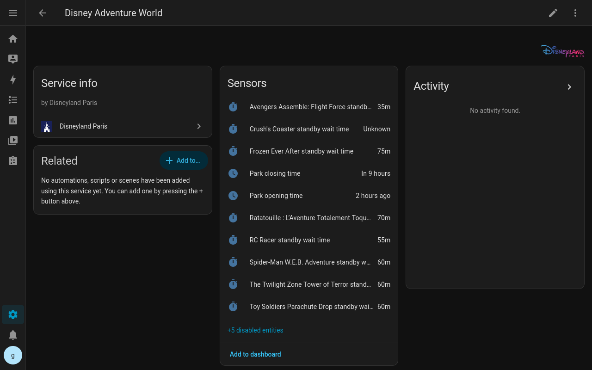

# Disneyland Paris Integration for Home Assistant

This custom integration allows Home Assistant to monitor Disneyland Paris park information, including park opening and closing times and current standby wait times for attractions across Disneyland Park and Disney Adventure World.

## Features

* Monitor Disneyland Park opening and closing times
* Monitor Disney Adventure World opening and closing times
* Monitor attraction standby wait times in minutes

## Installation

### HACS (Recommended)

[](https://my.home-assistant.io/redirect/hacs_repository/?owner=glenndehaan&repository=homeassistant-disneyland-paris)

1. Ensure HACS is installed. If not, follow the [HACS installation guide](https://hacs.xyz/docs/use/download/download/).
2. Go to **HACS → Integrations**
3. Search for "Disneyland Paris" and install the integration.
4. Restart Home Assistant
5. Go to **Settings → Devices & Services** and add **Disneyland Paris**

### Manual

1. Clone this repository or download it as a ZIP.
2. Copy the `custom_components/disneyland_paris` folder to your Home Assistant configuration at `/config/custom_components/disneyland_paris`.
3. Restart Home Assistant.
4. Add Disneyland Paris via the UI (Settings → Devices & Services).

## Configuration

This integration uses a **UI config flow** — no YAML setup is needed.

### Entity Overview

This integration exposes sensor entities for Disneyland Paris park and attraction information.

**Park sensors**: Opening time and closing time for Disneyland Park and Disney Adventure World
**Attraction sensors**: Current standby wait time, reported in minutes, for supported attractions in both parks

## Troubleshooting

* Ensure your Home Assistant instance has access to the internet.
* Enable debug logging for troubleshooting:

```yaml
logger:
  default: info
  logs:
    custom_components.disneyland_paris: debug
```

## Contributions

Issues and pull requests are welcome.
Please open an issue to report bugs or request features.

## Screenshots



## License

MIT
